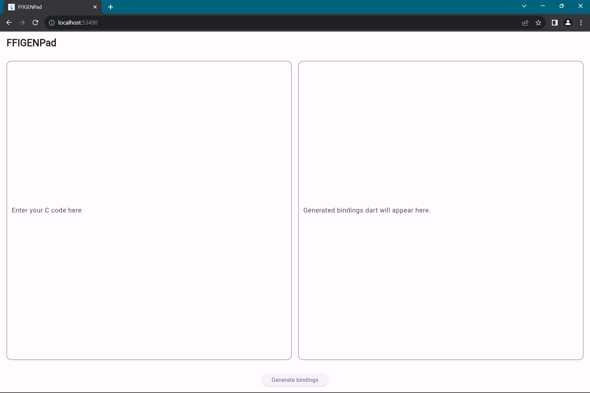
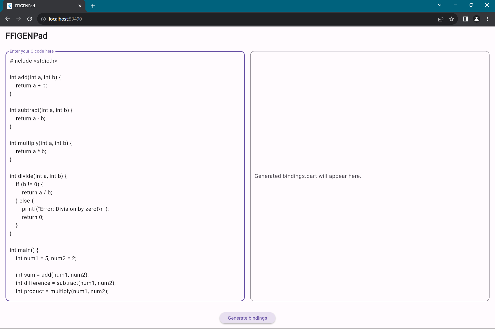
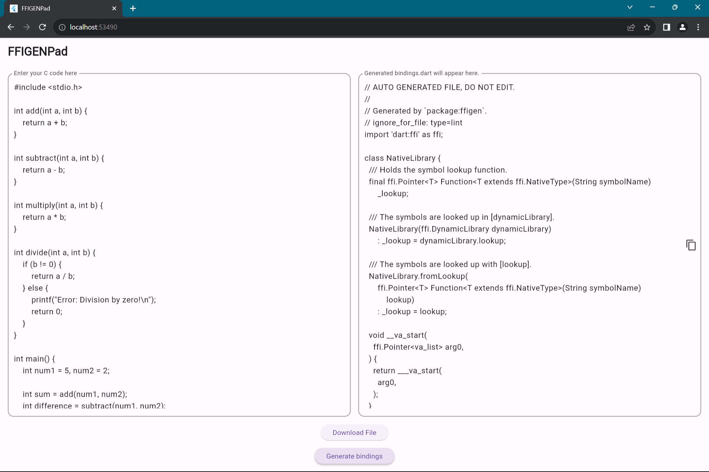

# C Header to Dart:ffi Bindings Generator

This web application provides a convenient interface for generating Dart:ffi bindings from C headers using the `package:ffigen` library. Simply paste your C header into the left textbox, and the corresponding Dart:ffi bindings will be displayed in the right textbox.

## Features

- **Simple Interface:** Easy-to-use web interface for generating Dart:ffi bindings.
- **Real-time Updates:** See the Dart:ffi bindings update in real-time as you paste your C header.
- **Copy-Paste Ready:** Copy the generated Dart:ffi bindings with a single click.

## Usage

1. Paste your C header into the textbox on the left.

2. Wait for the Dart:ffi bindings to be generated and displayed on the right.

   

3. Copy the generated Dart:ffi bindings and use them in your Dart projects.

## How to Run Locally

1. Clone this repository to your local machine
2. Navigate to the project directory
3. Install dependencies by running `flutter pub get`
4. run server.dart and main.dart with `flutter run lib/server.dart` and `flutter run lib/main.dart` respectively
5. See the Dart:ffi bindings update in real-time as you paste your C header

